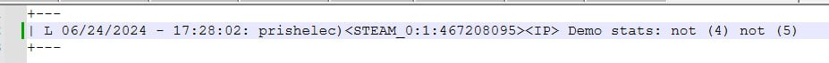
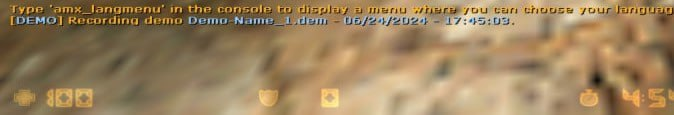

# Demo recorder

Плагин Demo recorder для Counter-Strike 1.6

## Основной функционал

- Плагин автоматически записывает демо у игрока.
- Всего плагин записывает от 5-10 демо (зависит от квара demo_num) и в случае если демо дошло до максимального кол-ва, то плагин перезаписывает демо с началa (1)
- Плагин проверяет при подключении игрока забанен ли игрок, чтобы не записывать демо у забаненых игроков.
- С помощью recheker плагин проверяет кол-во демо у игрока и выводит информацию о демках у игроков в меню (demo_menu)
- В меню (demo_menu) для флага (ADMIN_BAN) можно посмотреть какая демка у игрока записывается, какие демки есть, каких демо нет. Также можно забанить через меню игрока на "Чек демо"
- При любых банах, в лог сервера пишется: какое демо записывалось при бане у игрока и какие демки у него есть.
- При первом запуске плагина создается конфиг файл с настройками кварав плагина (/plugins/demo_recorder.cfg).

## Требования

- [ReHLDS](https://dev-cs.ru/resources/64/)
- [Amxmodx 1.9.0](https://www.amxmodx.org/downloads-new.php)
- [Fresh Bans](https://dev-cs.ru/resources/196/)
- [Resources Checker](https://dev-cs.ru/resources/72/)

## Квары
| Cvar | Default | Description |
| :-: | :-: | :-: |
| demo_num | 5 | Кол-во демо (5-10) |
| demo_name | Demo-name | Название демок |
| demo_prefix | DEMO | Префикс плагина в чатах |

## Скриншоты

- Меню

- Меню

- Сообщение, когда игрока забанили.

- Сообщение в чат
